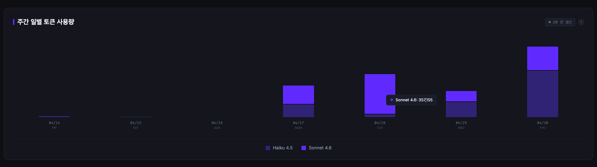
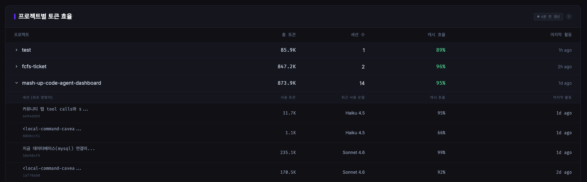

# 사용량 탭 소개

## 1. 기능 명세

### 상단 사용량 카드


- `5시간 사용량 한도`
  - Claude Code statusline의 rate limit 정보를 이용해 5시간 기준 사용량 퍼센트와 리셋까지 남은 시간을 표시
- `주간 한도`
  - 7일 기준 사용량 퍼센트와 리셋까지 남은 시간을 표시
- `이번 주 세션 수`
  - 최근 7일 내 활동이 있었던 세션 수를 집계해 표시

### 주간 일별 토큰 사용량



- 최근 7일간의 토큰 사용량을 일별 스택 막대 그래프로 표시
- 모델별 토큰 사용량을 색상으로 구분
- 하루 단위로 어떤 모델을 얼마나 썼는지 한눈에 볼 수 있음

### 프로젝트별 토큰 효율



- 프로젝트별 총 토큰 사용량, 세션 수, 캐시 효율, 마지막 활동 시각을 표시
- 아코디언을 펼치면 프로젝트 하위 세션별 사용량과 최근 사용 모델, 캐시 효율, 마지막 활동까지 확인 가능
- 현재 활성 세션과 usage 집계를 연결해, 가능한 경우 마지막 활동을 `실시간`으로 우선 표기

## 2. 통신 방법별 구현 소개

### 훅에서 받아오는 정보

- `StatusLine` 훅
  - `rate_limits.five_hour.used_percentage`
  - `rate_limits.five_hour.resets_at`
  - `rate_limits.seven_day.used_percentage`
  - `rate_limits.seven_day.resets_at`
  - 이 값을 사용해 상단 5시간/7일 사용량 카드 구현

### 로그를 읽어서 가져오는 정보

- 대상 로그
  - `~/.claude/projects/**/*.jsonl`

- 로그에서 읽는 정보
  - assistant usage 레코드의 `input_tokens`, `output_tokens`
  - 캐시 관련 토큰
  - 모델명
  - timestamp
  - cwd / sessionId

- 이 로그를 기반으로 계산하는 값
  - 주간 일별 토큰 사용량
  - 프로젝트별 총 토큰 사용량
  - 프로젝트별 / 세션별 캐시 효율
  - 프로젝트별 마지막 활동 시각
  - 최근 7일 활동 세션 수

- 캐시 효율 계산식

```js
cacheEfficiency =
  cache_read_tokens /
  (input_tokens + cache_creation_tokens + cache_read_tokens)
```

  - 캐시에서 실제로 읽어온 토큰이 전체 입력 관련 토큰 중 얼마나 되는지 비율로 계산

- 로그 감시 / 읽기 원리
  - `chokidar`로 `~/.claude/projects/**/*.jsonl` 파일 변경을 감시
  - 이 라이브러리는 OS별 파일 시스템 이벤트를 추상화해서 사용함
    - macOS에서는 FSEvents 계열
    - Linux에서는 보통 inotify 계열
  - 파일이 바뀌면 전체를 다시 읽는 것이 아니라, `file_offsets`에 저장된 마지막 읽은 위치부터 끝까지 새로 append된 부분만 읽음
  - 즉 `offset → 파일 끝` 구간만 증분 파싱하는 구조
  - 파싱한 usage 레코드는 `usage_records`에 저장하고, 같은 트랜잭션 안에서 `file_offsets`도 함께 갱신
  - 그래서 이미 읽은 구간을 매번 다시 읽지 않고, 재시작 후에도 이어서 수집 가능

## 3. 설계 고민 소개

### 3-1. 로그 파일 파싱 vs Claude OpenTelemetry

#### 로그 파일을 읽는 방식의 장점

- 추가 환경변수 설정 없이 바로 쓸 수 있음
- 이미 Claude Code가 남기는 로컬 데이터만으로 구현 가능
- 원하는 정보를 원하는대로 가공해 사용할 수 있음

#### 로그 파일을 읽는 방식의 한계

- 로그 파일 쓰기 자체가 실시간이 아님
- Claude Code가 로그를 쓰는 시점이 Tool 수행 직후가 아니라, 세션 저장 시점이나 종료 시점 등 약간 늦을 수 있음
- 따라서 사용량 탭도 완전 실시간이 아니라, 로그가 append된 뒤에 반영되는 구조
- 이건 우리 코드의 문제가 아니라 Claude Code 로그 기록 방식의 한계에 가까움

#### OpenTelemetry를 쓰면 좋아지는 점

- usage 이벤트를 더 직접적이고 빠르게 받을 수 있음
- 로그 파일 쓰기 지연 문제를 우회할 수 있음

#### OpenTelemetry의 단점

- 사용자가 직접 환경변수를 설정해야 함
  - 예: `export OTEL_EXPORTER_OTLP_ENDPOINT="http://localhost:4318/"`
- 대시보드를 켜지 않은 상태에서도 엔드포인트가 열려 있으면 데이터를 버리게 됨
- 현재 프로젝트의 목표가 “로컬에서 바로 켜서 쓰는 대시보드”인 점을 고려하면 초기 도입 비용이 있음

#### 현재 판단

- 우선은 로그 파일 기반 구현을 채택
- 다만 “정말 더 실시간성이 중요해지면 OTel로 교체할 수 있다”는 확장 가능성은 열어둠

### 3-2. 실시간 변경 이벤트 발생 시 파일 중복 읽기 문제

#### 문제 상황

- 파일 초기 스캔은 `await`로 순차 처리되고 있어서 문제 없음
- 문제는 watcher가 실시간 `change` 이벤트를 받을 때 발생

기존 `parseFile()` 흐름:

1. `file_offsets`에서 마지막 읽은 오프셋 조회
2. 그 오프셋부터 파일 끝까지 새 줄 파싱
3. 끝난 뒤 새 오프셋 저장

이때 같은 파일에 대해:

1. watcher 이벤트 A가 들어와 `parseFile(file)` 시작
2. A가 끝나기 전에 같은 파일에 watcher 이벤트 B가 또 들어옴
3. B도 같은 `last_offset`를 읽음
4. A와 B가 같은 append 구간을 동시에 파싱
5. 결과적으로 토큰 사용량과 usage 레코드가 중복 집계될 수 있음

#### 왜 이런 문제가 생기나

- DB 쓰기 자체는 같은 Node 프로세스 안에서 동기적으로 처리되므로 동시성 문제가 크지 않음
- 하지만 파일 읽기는 비동기 스트림 기반이라, 같은 파일에 대한 파서가 동시에 둘 이상 돌 수 있음
- 문제는 “이벤트가 여러 번 들어오는 것”이 아니라 “같은 파일에 대한 파서가 동시에 여러 개 도는 것”

#### 해결 방향 후보

1. 전역 순차 처리
2. 파일별 순차 처리

#### 채택한 방식: 파일별 순차 처리

- 다른 파일은 병렬로 처리 가능
- 같은 파일만 순차 처리
- 메모리 수준에서 파일 경로를 키로 하는 큐를 둠

### 파일 경로를 키로 사용하는 Promise Chain 큐

```js
const fileParseQueues = new Map();

function enqueueFileParse(filePath, sessionId, fallbackProjectPath) {
  const queueKey = path.resolve(filePath);
  const previous = fileParseQueues.get(queueKey) || Promise.resolve();
  const current = previous
    .catch(() => {})
    .then(async () => {
      await parseFile(filePath, sessionId, fallbackProjectPath);
      broadcastUsage();
    });

  fileParseQueues.set(queueKey, current);
  current.finally(() => {
    if (fileParseQueues.get(queueKey) === current) {
      fileParseQueues.delete(queueKey);
    }
  });
  return current;
}
```

#### 결과

- 같은 파일에 대한 파싱은 항상 한 번에 하나만 실행
- 이벤트가 여러 개 들어와도 순서대로 처리
- 이미 읽은 구간을 중복으로 파싱하지 않음
- 토큰 중복 집계와 중복 레코드 저장 문제를 완화
